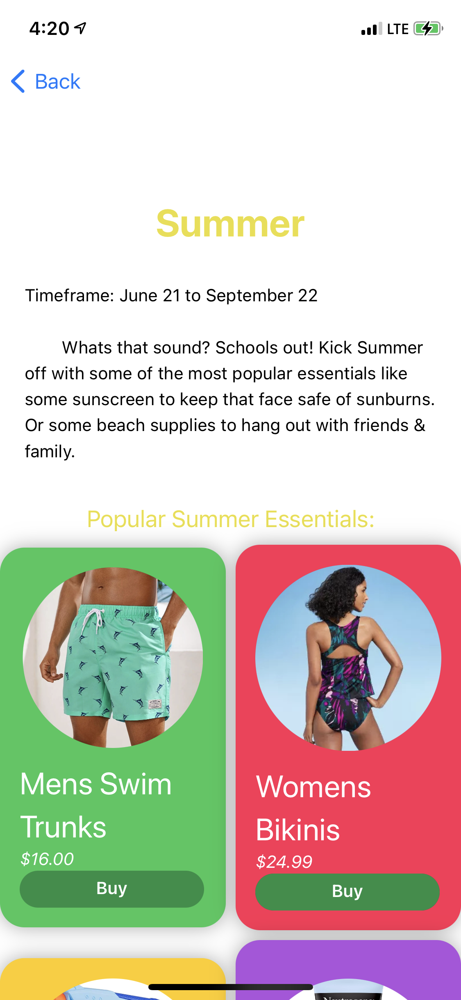
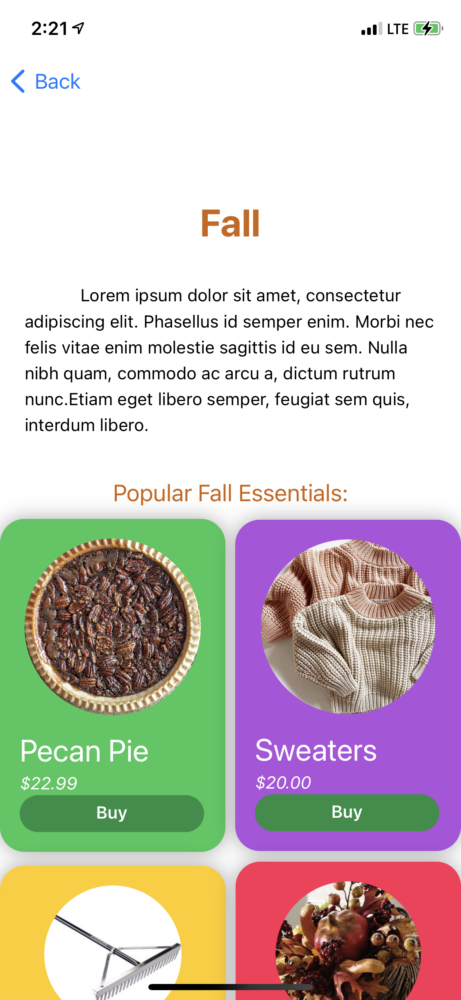
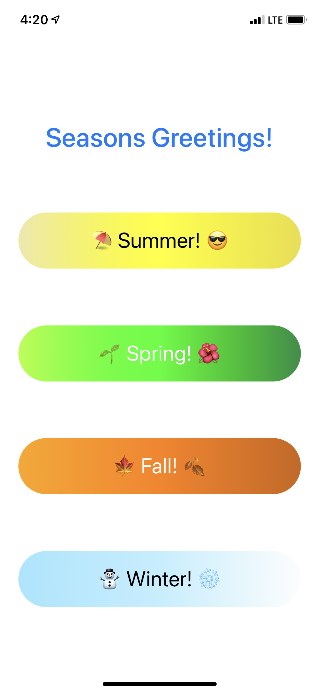

# Hackathon-March

### Summary:
This app is a small but useful assistant that can shows you the most useful items you'll be needing during that season you select. The app features multi page set ups to keep everything in order and neat. As well as handy buttons to navigate you to any item that catches your eye. 

**ContentView.swift** 
> Main page of the app when first opened.

**SummerView.swift**
> Summer page of the app with all its contents.

**SpringView.swift**
> Spring page of the app with all its contents.

**FallView.swift**
> Fall page of the app with all its contents.

**WinterView.swift**
> Winter page of the app with all its contents.

**Launch Screen.storyboard**
> The launch screen of the app. 

**Assets.xcassets**
> Folder containing all the assests such as images, and color sets.
   >* Colors: All the color sets
   >* Fall_Images: Images for the fall page
   >* Spring_Images: Images for the spring page
   >* Summer_Images: Images for the summer page
   >* Winter_Images: Images for the winter page.
  
  
  
**More Files**

_______________________
_______________________

_______________________
_______________________

__________________________________________________________________________________________________
*Files ending in .swift are the files that contain all the code that actually shows up in the app* 

Not avaliable for download because I don't want to pay Apple 100 dollars.

Created by: Marko Kupresanin
